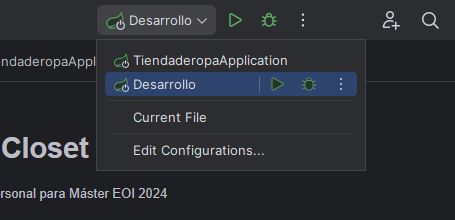

# Chic Closet

Proyecto personal para Máster EOI 2024

# INTRODUCCIÓN

- La siguiente iniciativa ha sido creada por el Grupo 2 como proyecto final para el
bootcamp de Java impartido por la EOI de abril a septiembre del 2024. A lo largo de
los meses de curso se ha vertido todo el conocimiento adquirido en la creación de la
siguiente aplicación web de venta de ropa combinando los conocimientos adquiridos
sobre Java, POO (Programación Orientada a Objetos), Maven, Hibernate, Springboot,
JDBC (Java Database Connectivity), JPA, Thymeleaf, MySQL, HTMLS5, CSS y Bootstrap.

# OBJETIVO DEL PROYECTO 

- La idea del proyecto es crear una aplicación web para una tienda de ropa online que
permita a los usuarios explorar, buscar y comprar diversos productos de moda,
incluyendo funciones como: navegación por categorías, búsqueda de productos,
gestión de carrito de compras y realización de pagos.

- El público objetivo es la franja demográfica de personas jóvenes de todos los géneros
interesadas en el punto de convergencia entre la última moda y el depórte, también
conocido como leisurewear, por lo que se ofrece un amplio rango de categorías para
que los usuarios puedan escoger.

# PROCESO DE FLUJOS

- EN DESARROLLO

# ROADMAP

- EN DESARROLLO

# MANUAL DE LA APLIACACIÓN WEB

- EN DESARROLLO

# MANUAL DE LA APLICACIÓN WEB

- EN DESARROLLO

# CONCLUSIONES

- EN DESARROLLO

# INSTALACIÓN 

Para proceder a la instalación y ejecución de la aplicación, debemos seguir los siguientes pasos:

 - Instalar Docker Desktop o Docker web.
 - Ejecutar el comando que hay en el archivo 'docker-run.txt' para crear el contenedor de la base de datos de el proyecto
 - Arrancar el proyecto con el perfil "Desarrollo" activado

